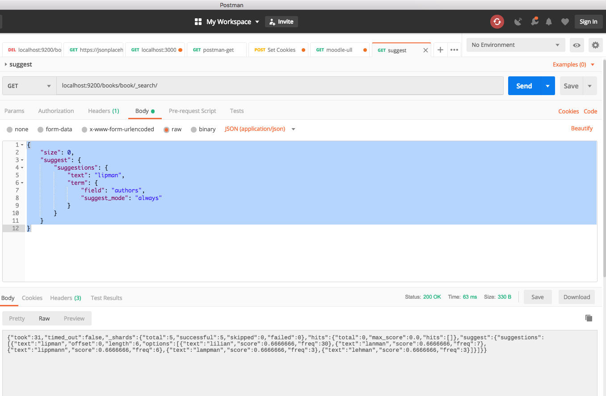

## Advantages of Express
Express  is modeled after Ruby [Sinatra http://www.sinatrarb.com/](http://www.sinatrarb.com/)

**web-services/server.js**

```js
'use strict';
const http = require('http');
const server = http.createServer((req, res) => {
  res.writeHead(200, {'Content-Type': 'text/plain'});
  res.end('Hello World!\n');
});
server.listen(60700, () => console.log('Server listening in port 60700'))
```

A typical web server would take care of lots of little jobs that this code doesn’t touch.

Here are some examples:

* Routing based on URL paths
* Managing sessions via cookies
* Parsing incoming requests (such as form data or JSON)
* Rejecting malformed requests

The [Express http://expressjs.com/](http://expressjs.com/)framework helps with these and myriad other tasks.

## Serving APIs with Express

```
[~/sol-nodejs-the-right-way/developing-restful-web-services-chapter-7(master)]$ npm i express morgan
+ morgan@1.9.1
+ express@4.16.4
added 48 packages from 35 contributors and audited 475 packages in 8.46s
found 0 vulnerabilities
```

```
[~/.../web-services/b4(master)]$ jq .dependencies ~/sol-nodejs-the-right-way/package.json
{
  "chai": "^4.2.0",
  "cheerio": "^1.0.0-rc.2",
  "commander": "^2.19.0",
  "express": "^4.16.4",
  "morgan": "^1.9.1",
  "nconf": "^0.10.0",
  "node-dir": "^0.1.17",
  "node-red": "^0.19.5",
  "nodemon": "^1.18.7",
  "request": "^2.88.0",
  "request-promise": "^4.2.2",
  "zeromq": "^5.0.0",
  "zerorpc": "^0.9.8"
}
```

**Code of hello/server.js**

```js
'use strict';
const express = require('express');
const morgan = require('morgan');

const app = express();

app.use(morgan('dev'));

// In addition to get(), Express has put(), post(), and delete()
// methods to register handlers for HTTP PUT, POST, and DELETE requests,
// respectively
app.get('/hello/:name', (req, res) => {
  res.status(200).json({hello: req.params.name});
});

app.listen(60701, ()=> console.log("Listening on 60701"));

```


**Starting the Client**:

```
gulp.task("c7-express-client", shell.task(
  `curl -s localhost:60701/hello/ivan | jq`
));
```

```
[~/local/src/CA/sol-nodejs-the-right-way/commanding-databases-chapter-6(master)]$ gulp c7-express-client
[12:33:33] Working directory changed to ~/local/src/CA/sol-nodejs-the-right-way
[12:33:33] Using gulpfile ~/local/src/CA/sol-nodejs-the-right-way/gulpfile.js
[12:33:33] Starting 'c7-express-client'...
{
  "hello": "ivan"
}
[12:33:33] Finished 'c7-express-client' after 51 ms
```

## Writing Modular Express Services

We’re going to build a RESTful web service with Express for creating and managing book bundles. Here’s an example of a book bundle:

```json
​ 	{
​ 	  ​"name"​: ​"light reading"​,
​ 	  ​"books"​: [{
​ 	    ​"id"​: ​"pg132"​,
​ 	    ​"title"​: ​"The Art of War"​
​ 	  },{
​ 	    ​"id"​: ​"pg2680"​,
​ 	    ​"title"​: ​"Meditations"​,
​ 	  },{
​ 	    ​"id"​: ​"pg6456"​,
​ 	    ​"title"​: ​"Public Opinion"​
​ 	  }]
​ 	}
```

* The fields in `name` do not have to be unique.
* The app will be called *Better Book Bundle Builder* (or `B4` for short)
* To the `B4` application, the `books` index is read-only (we will not add, delete, or overwrite any documents in it).
* The `b4` index will store user data, including the book bundles that users make.

To create the `b4` index,
1. make sure Elasticsearch is running,
2. then open a terminal to the `esclu` directory
3. Use `esclu` to create the b4 index:

```
[~/local/src/CA/sol-nodejs-the-right-way/commanding-databases-chapter-6/esclu(master)]$ ./esclu create-index -i b4
{"acknowledged":true,"shards_acknowledged":true,"index":"b4"}
[~/local/src/CA/sol-nodejs-the-right-way/commanding-databases-chapter-6/esclu(master)]$ ./esclu li
health status index    uuid                   pri rep docs.count docs.deleted store.size pri.store.size
yellow open   b4       Wt45klL2TA-p-VvYRWegoA   5   1          0            0      1.1kb          1.1kb
yellow open   accounts 9TNc0k0LQ1e4y97yFX8_vg   5   1          2            0     10.4kb         10.4kb
yellow open   books    wP3DgQPZQZq0qBtH_dd0LA   5   1      58159            3     23.2mb         23.2mb
```

## How **nconf** manages configuration settings

The [nconf](https://www.npmjs.com/package/nconf) module manages configuration settings through a customizable hierarchy of

* config files,
* environment variables, and
* command-line arguments.

The order in which you load a source of configuration determines its precedence.

See the repo [learning-nconf](https://github.com/ULL-MII-CA-1819/learning-nconf)
for a simple example of use.

See the tutorial [Using nconf to configure a Node.js application](http://blog.osmosys.asia/2017/08/18/nconf-nodejs-application/)

The order in which you load a source of configuration determines its precedence. Earlier values stick, meaning that later values will not overwrite them.

**[Code of hello-nconf.js](https://github.com/ULL-MII-CA-1819/learning-nconf/blob/master/hello-nconf.js)**

```js
var fs    = require('fs'),
    nconf = require('nconf');

// The order in which you attach the configuration sources determines their priority in the hierarchy.
// Setup nconf to use (in-order):
//   1. Command-line arguments
//   2. Environment variables
//   3. A file located at 'path/to/config.json'
//
nconf.argv() // Loads process.argv using yargs. If options is supplied it is passed along to yargs.
 .env('__')      // Loads process.env into the hierarchy
 .file({ file: './config.json' });

// See "node hello-nconf.js --conf='./config-2.json'"
nconf.get('conf') && nconf.file(nconf.get('conf'));

/*
  nconf.env()
   .file({ file: './config.json' })
   .argv();
*/
/*
  nconf
   .file({ file: './config.json' })
   .argv()
   .env() ;
*/
//
// Set a few variables on `nconf`.
//
nconf.set('database:host', '127.0.0.1');
nconf.set('database:port', 4000);

console.log('foo: ' + nconf.get('foo'));
console.log('NODE_ENV: ' + nconf.get('NODE_ENV'));

//
// Get the entire database object from nconf. This will output
// { host: '127.0.0.1', port: 5984 }
//
console.log('database: ' + JSON.stringify(nconf.get('database')));

// It is important to note that setting keys in the File engine will not be persisted
// to disk until a call to .save() is made
// Save the configuration object to disk
//
nconf.save(function (err) {
  fs.readFile('./config.json', function (err, data) {
    console.dir(JSON.parse(data.toString()))
  });
});

```

The double underscore string passed to `env` means that two underscores should be used to denote object hierarchy when reading from environment variables. This is because many shell programs do not allow colon characters in variable names.


```js
  nconf.argv()     // Loads process.argv using yargs. If options is supplied it is passed along to yargs.
   .env('__')      // Loads process.env into the hierarchy
   .file({ file: './config.json' });
```


**Ejecución:**

```
[~/local/src/javascript/learning/learning-nconf(master)]$ cat config.json
{
  "foo": "chuchu",
  "NODE_ENV": "test",
  "database": {
    "host": "titi.tutu.tata.es",
    "port": 1234
  }
}
[~/local/src/javascript/learning/learning-nconf(master)]$ node hello-nconf.js
foo: chuchu
NODE_ENV: test
database: {"host":"127.0.0.1","port":4000}
{ foo: 'chuchu',
  NODE_ENV: 'test',
  database: { host: '127.0.0.1', port: 4000 } }
```

Another execution:

```
[~/local/src/javascript/learning/learning-nconf(master)]$ cat config.json
{
  "foo": "chuchu",
  "NODE_ENV": "test",
  "database": {
    "host": "127.0.0.1",
    "port": 4000
  }
}[~/local/src/javascript/learning/learning-nconf(master)]$ database__host=chuchu.deioc.ull.edu.es node hello-nconf.js --foo bar
foo: bar
NODE_ENV: test
database: {"host":"chuchu.deioc.ull.edu.es","port":4000}
{ foo: 'chuchu',
  NODE_ENV: 'test',
  database: { host: '127.0.0.1', port: 4000 } }
```

An yet another execution using the `--conf` argument in the command line to change the config file:

```
[~/local/src/javascript/learning/learning-nconf(master)]$ cat config.json
{
  "foo": "chuchu",
  "NODE_ENV": "test",
  "database": {
    "host": "127.0.0.1",
    "port": 4000
  }
}[~/local/src/javascript/learning/learning-nconf(master)]$ cat config-2.json
{
  "foo": "zas!",
  "NODE_ENV": "testing",
  "database": {
    "host": "pito.pito.gorgorito",
    "port": 1234
  }
}
[~/local/src/javascript/learning/learning-nconf(master)]$ node hello-nconf.js --conf='./config-2.json'
foo: zas!
NODE_ENV: testing
database: {"host":"127.0.0.1","port":4000}
{ foo: 'chuchu',
  NODE_ENV: 'test',
  database: { host: '127.0.0.1', port: 4000 } }
```

See the tutorial [Using nconf to configure a Node.js application](http://blog.osmosys.asia/2017/08/18/nconf-nodejs-application/)

## Keeping Services Running with nodemon

`nodemon` runs a Node.js program and then automatically restarts it whenever the source code changes or if the process terminates.

```
[~/local/src/CA/sol-nodejs-the-right-way/developing-restful-web-services-chapter-7(master)]$ npm i nodemon
[~/local/src/CA/sol-nodejs-the-right-way/developing-restful-web-services-chapter-7(master)]$ sed -ne '/dep/,/}/p' ../package.json
  "dependencies": {
    "chai": "^4.2.0",
    "cheerio": "^1.0.0-rc.2",
    "express": "^4.16.4",
    "morgan": "^1.9.1",
    "nconf": "^0.10.0",
    "node-dir": "^0.1.17",
    "nodemon": "^1.18.7",
    "zeromq": "^5.0.0",
    "zerorpc": "^0.9.8"
  }
```

### Separating Server Code into Modules

To start, create a directory called `b4` to house the B4 project. to optimize storage we use the `package.json` at the root project level:


```
[~/sol-nodejs-the-right-way/developing-restful-web-services-chapter-7/web-services(master)]$ mkdir b4
[~/sol-nodejs-the-right-way/developing-restful-web-services-chapter-7/web-services(master)]$ cd b4
[~/sol-nodejs-the-right-way/developing-restful-web-services-chapter-7/web-services/b4(master)]$ npm i nconf
+ nconf@0.10.0
added 13 packages from 17 contributors and audited 511 packages in 4.154s
found 0 vulnerabilities

[~/sol-nodejs-the-right-way/developing-restful-web-services-chapter-7/web-services/b4(master)]$ sed -ne '/dep/,/}/p' ~/sol-nodejs-the-right-way/package.json
  "dependencies": {
    "chai": "^4.2.0",
    "cheerio": "^1.0.0-rc.2",
    "express": "^4.16.4",
    "morgan": "^1.9.1",
    "nconf": "^0.10.0",
    "node-dir": "^0.1.17",
    "zeromq": "^5.0.0",
    "zerorpc": "^0.9.8"
  }
```

This is our configuration file:

**[Contents of web-services/b4/config.json](https://github.com/ULL-MII-CA-1819/nodejs-the-right-way/blob/master/developing-restful-web-services-chapter-7/web-services/b4/config.json#L10)**

```json
{
  "port": 60702,
  "es": {
    "host": "localhost",
    "port": 9200,
    "books_index": "books",
    "bundles_index": "b4"
  }
}
```

**[Contents of web-services/b4/server.js](https://github.com/ULL-MII-CA-1819/nodejs-the-right-way/blob/master/developing-restful-web-services-chapter-7/web-services/b4/server.js)**

```js
'use strict';

const express = require('express');
const morgan = require('morgan');
const nconf = require('nconf');
                  // b4  web-services chapter-7
const pkg = require('../../../package.json');

nconf.argv().env('__');
nconf.defaults({conf: `${__dirname}/config.json`});
nconf.file(nconf.get('conf'));

const app = express();
app.use(morgan('dev'));

app.get('/api/version', (req, res) => {
  res.status(200).send(pkg.version);
});

require('./lib/search.js')(app, nconf.get('es'));
require('./lib/bundle.js')(app, nconf.get('es'));
app.listen(nconf.get('port'), () => console.log('Listening on port '+nconf.get('port')));
```

Run the server:

```
[~/sol-nodejs-the-right-way/developing-restful-web-services-chapter-7/web-services/b4(master)]$ npm run b4-server

> nodejs-8-the-right-way@1.0.0 b4-server /Users/casiano/local/src/CA/sol-nodejs-the-right-way
> node developing-restful-web-services-chapter-7/web-services/b4/server.js

Listening on port 60702
GET /api/version 200 3.857 ms - 5
```

Run a client:
```
[~/local/src/CA/sol-nodejs-the-right-way(master)]$ curl -s localhost:60702/api/version
1.0.0
```
or use `gulp`:

```
gulp.task("c7-b4-version", shell.task(
  `curl -s localhost:60702/api/version`
));

[~/local/src/CA/sol-nodejs-the-right-way(master)]$ gulp c7-b4-version
[10:20:46] Using gulpfile ~/local/src/CA/sol-nodejs-the-right-way/gulpfile.js
[10:20:46] Starting 'c7-b4-version'...
1.0.0[10:20:46] Finished 'c7-b4-version' after 63 ms
```


## Adding Search APIs

### Using Requests with Express

```js
app.get('/api/search/books/:field/:query', (req, res) => {
  const esReqBody = {
    size: 10, // limits the number of documents that will be sent back
    query: {  // describes what kind of objects we want to find
      match: {
        [req.params.field]: req.params.query
      }
    }
  };
  ...
```

* When a JavaScript object literal key is surrounded with brackets, like `[req.params.field]` is here, this is called a **computed property name**
* The expression inside the brackets is evaluated at runtime, and the result is used as the key.
* In this case, since the expression in brackets is `req.params.field`, the key used in the match object will be whatever the `:field` param of the incoming request contained.
* See this code:
```
$ node
> a = "hello"
'hello'
> b = 4
4
> x = {[a]: b}
{ hello: 4 }
>
```

**[web-services/b4/lib/search.js](https://github.com/ULL-MII-CA-1819/nodejs-the-right-way/blob/master/developing-restful-web-services-chapter-7/web-services/b4/lib/search.js)**

```js
/**
  * Provides API endpoints for searching the book index
*/
'use strict';
const request = require('request');
const rp = require('request-promise');

module.exports = (app, es) => {
  const url = `http://${es.host}:${es.port}/${es.books_index}/book/_search`;
  /**
   * Search for books matching a particular field value
   * Example: /api/search/books/authors/Twain
   */
  app.get('/api/search/books/:field/:query', (req, res) => {
    const esReqBody = {
      size: 10, // limits the number of documents that will be sent back
      query: {  // describes what kind of objects we want to find
        match: {
          [req.params.field]: req.params.query
        }
      }
    };
    const options = {url, json: true, body: esReqBody };

    request.get(options, (err, esRes, esResBody) => {
      if (err) {
        res.status(502).json({
          error: 'bad_gateway',
          reason: err.code
        });
      }
      if (esRes.statusCode !== 200) {
        res.status(esRes.statusCode).json(esResBody);
        return;
      }
      res.status(200).json(esResBody.hits.hits.map(({_source}) => _source));
    });
  });

  /**
   * Collect suggested terms for a given field based on a given query
   * Example: /api/suggest/authors/lipman
  */
  app.get('/api/suggest/:field/:query', (req, res) => {
    const esReqBody = {
      size: 0, // We don’t want any matching documents returned, just the suggestions
      suggest: {
        suggestions: { // Elasticsearch’s Suggest API allows you to request multiple
                       // kinds of suggestions in the same request,
                       // but here we’re submitting only one. 
          text: req.params.query,
          term: {
            field: req.params.field,
            suggest_mode: 'always'
          }
        }
      }
    };
    const options = { url, json: true, body: esReqBody };
    const promise = rp(options);
    /*
    // Version from section: "Using a Promise with request", pages 162-166
    const promise = new Promise((resolve, reject) => {
      request.get(options, (err, esRes, esResBody) => {
        if (err) {
          reject({error: err});
          return;
        }
        if (esRes.statusCode !== 200) {
          reject({error: esResBody});
          return;
        }
        resolve(esResBody);
      });
    });
    */
    promise
      .then(esResBody =>
        res.status(200).json(esResBody.suggest.suggestions)
      )
      .catch(
        ({error}) => res.status(error.status || 502).json(error)
      );
  });
};
```

* [Elasticsearch Match Query](https://www.elastic.co/guide/en/elasticsearch/reference/current/query-dsl-match-query.html)
```js
app.get('/api/search/books/:field/:query', (req, res) => {
  const esReqBody = {
    size: 10, // limits the number of documents that will be sent back
    query: {  // describes what kind of objects we want to find
      match: {
        [req.params.field]: req.params.query
      }
    }
  };
  const options = {url, json: true, body: esReqBody };

  request.get(options, (err, esRes, esResBody) => {
    if (err) {
      res.status(502).json({
        error: 'bad_gateway',
        reason: err.code
      });
    }
    if (esRes.statusCode !== 200) {
      res.status(esRes.statusCode).json(esResBody);
      return;
    }
    res.status(200).json(esResBody.hits.hits.map(({_source}) => _source));
  });
});
```

* [Status 502: Puerta de enlace no válida](https://developer.mozilla.org/es/docs/Web/HTTP/Status/502)
* [Elasticsearch errors](https://www.elastic.co/guide/en/elasticsearch/client/javascript-api/current/errors.html)

**[web-services/b4/server.js](https://github.com/ULL-MII-CA-1819/nodejs-the-right-way/blob/master/developing-restful-web-services-chapter-7/web-services/b4/server.js)**

```js
'use strict';

const express = require('express');
const morgan = require('morgan');
const nconf = require('nconf');
                  // b4  web-services chapter-7
const pkg = require('../../../package.json');

nconf.argv().env('__');
nconf.defaults({conf: `${__dirname}/config.json`});
nconf.file(nconf.get('conf'));

const app = express();
app.use(morgan('dev'));

app.get('/api/version', (req, res) => {
  res.status(200).send(pkg.version);
});

require('./lib/search.js')(app, nconf.get('es'));
require('./lib/bundle.js')(app, nconf.get('es'));
app.listen(nconf.get('port'), () => console.log('Listening on port '+nconf.get('port')));
```

**[web-services/b4/config.json](https://github.com/ULL-MII-CA-1819/nodejs-the-right-way/blob/master/developing-restful-web-services-chapter-7/web-services/b4/config.json)**

```json
{
  "port": 60702,
  "es": {
    "host": "localhost",
    "port": 9200,
    "books_index": "books",
    "bundles_index": "b4"
  }
}
```

**Executions:**

```
[~/sol-nodejs-the-right-way/developing-restful-web-services-chapter-7/web-services/b4(master)]$ grep b4-server ../../../package.json
    "test-now": "npm run b4-server",
    "b4-server": "node developing-restful-web-services-chapter-7/web-services/b4/server.js",
    "b4-server-nodemon": "nodemon developing-restful-web-services-chapter-7/web-services/b4/server.js",
[~/sol-nodejs-the-right-way/developing-restful-web-services-chapter-7/web-services/b4(master)]$ npm run b4-server

> nodejs-8-the-right-way@1.0.0 b4-server /Users/casiano/local/src/CA/sol-nodejs-the-right-way
> node developing-restful-web-services-chapter-7/web-services/b4/server.js

Listening on port 60702
```

```
[~/local/src/CA/sol-nodejs-the-right-way/developing-restful-web-services-chapter-7/web-services/b4(master)]$ sed -ne '/c7-b4-get/,/));/p' ../../../gulpfile.js
gulp.task("c7-b4-get-shakespeare", shell.task(
  `curl -s localhost:60702/api/search/books/authors/Shakespeare | jq .[].title`
));
gulp.task("c7-b4-get-sawyer", shell.task(
  `curl -s localhost:60702/api/search/books/title/sawyer | jq .[].title`
));
```

```
[~/local/src/CA/sol-nodejs-the-right-way/developing-restful-web-services-chapter-7/web-services/b4(master)]$ curl -s localhost:60702/api/search/books/authors/Shakespeare | jq .[].title
"Venus and Adonis"
"The Second Part of King Henry the Sixth"
"King Richard the Second"
"The Tragedy of Romeo and Juliet"
"A Midsummer Night's Dream"
"Much Ado about Nothing"
"The Tragedy of Julius Caesar"
"As You Like It"
"The Tragedy of Othello, Moor of Venice"
"The Tragedy of Macbeth"
```

```
[~/local/src/CA/sol-nodejs-the-right-way/developing-restful-web-services-chapter-7/web-services/b4(master)]$ curl -s localhost:60702/api/search/books/title/sawyer | jq .[].title
"Tom Sawyer Abroad"
"Tom Sawyer, Detective"
"Tom Sawyer Abroad"
"Tom Sawyer, Detective"
"The Adventures of Tom Sawyer"
"Tom Sawyer: Koulupojan historia"
"Tom Sawyer ilmailija\nHuckleberry Finn'in jatko"
"The Adventures of Tom Sawyer, Part 3."
"De Lotgevallen van Tom Sawyer"
"The Adventures of Tom Sawyer"
```

## Simplifying Code Flows with Promises

### Fulfilling Promises

* [Apuntes del profesor en Async JS](https://ull-mii-ca-1819.github.io/learning-js/_book/async-js/async-js.html)
* [Node.js Events: Error Events](https://nodejs.org/api/events.html#events_error_events)
    - When an error occurs within an `EventEmitter` instance, the typical action is for an `error` event to be emitted. These are treated as special cases within Node.js.
    - If an `EventEmitter` does not have at least one listener registered for the `error` event, and an `error` event is emitted, the error is thrown, a stack trace is printed, and the Node.js process exits.
* [The Promise Class at developer.mozilla.org](https://developer.mozilla.org/en-US/docs/Web/JavaScript/Reference/Global_Objects/Promise)

### Using a Promise with Request

* [Code of the Promise object for making the `/api/suggest` request](https://github.com/ULL-MII-CA-1819/nodejs-the-right-way/blob/master/developing-restful-web-services-chapter-7/web-services/b4/lib/search.js#L59-L74)
    * [Final code for the route /api/suggest/:field/:query in developing-restful-web-services-chapter-7/web-services/b4/lib/search.js](https://github.com/ULL-MII-CA-1819/nodejs-the-right-way/blob/master/developing-restful-web-services-chapter-7/web-services/b4/lib/search.js#L38-L77)
* Elasticsearch suggest
    * [The Elasticsearch `term` suggester suggests terms based on edit distance. The provided suggest text is analyzed before terms are suggested. The suggested terms are provided per analyzed suggest text token. The `term` suggester doesn’t take the query into account that is part of request.](https://www.elastic.co/guide/en/elasticsearch/reference/current/search-suggesters-term.html)
    * [Elasticsearch Suggesters: The suggest feature suggests similar looking terms based on a provided text by using a suggester](https://www.elastic.co/guide/en/elasticsearch/reference/6.5/search-suggesters.html)

#### Example of request to the Elasticsearch suggest API with `curl`


**[Code in gulpfile for task c7-es-suggest](https://github.com/ULL-MII-CA-1819/nodejs-the-right-way/blob/master/gulpfile.js#L358-L396)**:

```js
let trimnl = (s) => s.replace(/\s+/g,"");
let request = trimnl(`
  {
  	"size": 0,
  	"suggest": {
  		"suggestions": {
  			"text": "lipman",
  			"term": {
  				"field": "authors",
  				"suggest_mode": "always"
  			}
  		}
  	}
  }
`);

gulp.task('c7-es-suggest', shell.task(
  `curl -s  -H 'Content-Type: application/json' -d '${request}' -X GET localhost:9200/books/book/_search | jq .suggest.suggestions`
));
```

Respuesta del servidor es:

```bash
[~/sol-nodejs-the-right-way/developing-restful-web-services-chapter-7/web-services/b4(master)]$ gulp c7-es-suggest
[14:48:59] Working directory changed to ~/local/src/CA/sol-nodejs-the-right-way
[14:49:00] Using gulpfile ~/local/src/CA/sol-nodejs-the-right-way/gulpfile.js
[14:49:00] Starting 'c7-es-suggest'...
[
  {
    "text": "lipman",
    "offset": 0,
    "length": 6,
    "options": [
      {
        "text": "lilian",
        "score": 0.6666666,
        "freq": 30
      },
      {
        "text": "lanman",
        "score": 0.6666666,
        "freq": 7
      },
      {
        "text": "lippmann",
        "score": 0.6666666,
        "freq": 6
      },
      {
        "text": "lampman",
        "score": 0.6666666,
        "freq": 3
      },
      {
        "text": "lehman",
        "score": 0.6666666,
        "freq": 3
      }
    ]
  }
]
[14:49:00] Finished 'c7-es-suggest' after 66 ms
```

#### Example of request to the Elasticsearch suggest API with `postman`




#### Code for the Route '/api/suggest/:field/:query'

```js
/**
 * Collect suggested terms for a given field based on a given query
 * Example: /api/suggest/authors/lipman
*/
app.get('/api/suggest/:field/:query', (req, res) => {
  const esReqBody = {
    size: 0,
    suggest: {
      suggestions: {
        text: req.params.query,
        term: {
          field: req.params.field,
          suggest_mode: 'always'
        }
      }
    }
  };
  const options = { url, json: true, body: esReqBody };
  const promise = new Promise((resolve, reject) => {
    request.get(options, (err, esRes, esResBody) => {
      if (err) {
        reject({error: err});
        return;
      }
      if (esRes.statusCode !== 200) {
        reject({error: esResBody});
        return;
      }
      resolve(esResBody);
    });
  });
  promise
    .then(esResBody =>
      res.status(200).json(esResBody.suggest.suggestions)
    )
    .catch(
      ({error}) => res.status(error.status || 502).json(error)
    );
});
```

When making a request with curl we get:

```
[~/local/src/CA/sol-nodejs-the-right-way/developing-restful-web-services-chapter-7/web-services/b4(master)]$ curl -s localhost:60702/api/suggest/authors/lipman | jq .[].options[].text
"lilian"
"lanman"
"lippmann"
"lampman"
"lehman"
```

### Replacing request with request-promise

* [request-promise](https://github.com/request/request-promise) GitHub

```js
[~/local/src/CA/sol-nodejs-the-right-way/developing-restful-web-services-chapter-7/web-services/b4(master)]$ cat -n lib/search.js
     .........
     5	const request = require('request');
     6	const rp = require('request-promise');
     7
     8	module.exports = (app, es) => {
     9	  const url = `http://${es.host}:${es.port}/${es.books_index}/book/_search`;
    10	  /**
    11	   * Search for books matching a particular field value
    12	   * Example: /api/search/books/authors/Twain
    13	   */
    14	  app.get('/api/search/books/:field/:query', (req, res) => {
    ..........
    38	  });
    39
    40	  /**
    41	   * Collect suggested terms for a given field based on a given query
    42	   * Example: /api/suggest/authors/lipman
    43	  */
    44	  app.get('/api/suggest/:field/:query', (req, res) => {
    45	    const esReqBody = {
    46	      size: 0,
    47	      suggest: {
    48	        suggestions: {
    49	          text: req.params.query,
    50	          term: {
    51	            field: req.params.field,
    52	            suggest_mode: 'always'
    53	          }
    54	        }
    55	      }
    56	    };
    57	    const options = { url, json: true, body: esReqBody };
    58	    const promise = rp(options);
    59	    /*
    60	    // Version from section: "Using a Promise with request", pages 162-166
    61	    const promise = new Promise((resolve, reject) => {
    62	      request.get(options, (err, esRes, esResBody) => {
    63	        if (err) {
    64	          reject({error: err});
    65	          return;
    66	        }
    67	        if (esRes.statusCode !== 200) {
    68	          reject({error: esResBody});
    69	          return;
    70	        }
    71	        resolve(esResBody);
    72	      });
    73	    });
    74	    */
    75	    promise
    76	      .then(esResBody =>
    77	        res.status(200).json(esResBody.suggest.suggestions)
    78	      )
    79	      .catch(
    80	        ({error}) => res.status(error.status || 502).json(error)
    81	      );
    82	  });
    83	};
```

## Manipulating Documents RESTfully

* In this part, we'll be creating APIs for manipulating book bundles.
* A book bundle has a `name` and maintains a collection of related books.

Here’s an example of a book bundle:

```js
​  {
​    ​"name"​: ​"light reading"​,
​    ​"books"​: [
       {
  ​      ​"id"​: ​"pg132"​,
  ​      ​"title"​: ​"The Art of War"​
  ​     },
       {
        ​"id"​: ​"pg2680"​,
  ​      ​"title"​: ​"Meditations"​,
  ​     },
       {
  ​      ​"id"​: ​"pg6456"​,
  ​      ​"title"​: ​"Public Opinion"​
  ​     }
     ]
​  }
```
Creating these APIs will be programmatically more intensive than creating the search APIs because
**they require more back-and-forth between your Node.js service and the underlying datastore**.

For example, consider an API to update the `name` of a bundle. Our Node.js code will need to do the following:

1. Retrieve the bundle from Elasticsearch.
2. Update the `name` field on the object in memory.
3. Put the updated object back into Elasticsearch.

In addition to handling these asynchronously and in order, you’ll have to deal with various failure modes.
  - What if Elasticsearch is down?
  - What if the bundle doesn’t exist?
  - What if the bundle changed between the time Node.js downloaded it and the time it reuploaded it?
  - What if Elasticsearch fails to update for some other reason?

There are a lot of ways a sequence of asynchronous events could fail midstride, and it’s important to think about what kind of response you should provide to users of your API:
- What HTTP status code is closest to explaining the situation?
- What kind of error message should you present?

Fichero [`lib/bundle.js`](https://github.com/ULL-MII-CA-1819/nodejs-the-right-way/blob/master/developing-restful-web-services-chapter-7/web-services/b4/lib/bundle.js):

```js
/**
 * Provide API endpoints for working with book bundles_index
 */
'use strict';

const rp = require('request-promise');
module.exports = (app, es) => {
  const url = `http://${es.host}:${es.port}/${es.bundles_index}/bundle`;

  /**
   * Create a new bundle with the specified names
   * Example: curl -X POST http://<host>:<port>/api/bundle?name=<name>
   */
   app.post('/api/bundle', (req, res) => {
      const bundle = {
        name: req.query.name || '',
        books: []

      };

      rp.post({url, body: bundle, json: true})
        .then(esResBody => res.status(201).json(esResBody))
        .catch(({error}) => res.status(error.status || 502).json(error));
   });
};
```

Añadimos la dependencia de `lib/bundle.js` en [`server.js`](https://github.com/ULL-MII-CA-1819/nodejs-the-right-way/blob/master/developing-restful-web-services-chapter-7/web-services/b4/server.js#L21):

```diff
[~/local/src/CA/sol-nodejs-the-right-way/developing-restful-web-services-chapter-7/web-services/b4(master)]$ git diff server.js
diff --git a/developing-restful-web-services-chapter-7/web-services/b4/server.js b/developing-restful-web-services-chapter-7/web-services/b4/server.js
index 82ca3f1..c17bc87 100644
--- a/developing-restful-web-services-chapter-7/web-services/b4/server.js
+++ b/developing-restful-web-services-chapter-7/web-services/b4/server.js
@@ -18,4 +18,5 @@ app.get('/api/version', (req, res) => {
 });

 require('./lib/search.js')(app, nconf.get('es'));
+require('./lib/bundle.js')(app, nconf.get('es'));
 app.listen(nconf.get('port'), () => console.log('Listening on port '+nconf.get('port')));
```

Create a bundle using `curl`:

```
[~/local/src/CA/sol-nodejs-the-right-way/developing-restful-web-services-chapter-7/web-services/b4(master)]$ curl -s -X POST localhost:60702/api/bundle/?name=light%20reading | jq .
{
  "_index": "b4",
  "_type": "bundle",
  "_id": "zLkMWmcB1uX03maR3vEQ",
  "_version": 1,
  "result": "created",
  "_shards": {
    "total": 2,
    "successful": 1,
    "failed": 0
  },
  "_seq_no": 0,
  "_primary_term": 1
}
```

* Note the `_id` field.
* This is automatically generated by Elasticsearch for the new bundle document that was just created.
* Copy this string, as you’ll need it for the remaining examples in this chapter.
* It may help to put it in an environment variable for easy retrieval.

```
[~/local/src/CA/sol-nodejs-the-right-way/developing-restful-web-services-chapter-7/web-services/b4(master)]$ BUNDLE_ID=zLkMWmcB1uX03maR3vEQ
[~/local/src/CA/sol-nodejs-the-right-way/developing-restful-web-services-chapter-7/web-services/b4(master)]$ echo $BUNDLE_ID
zLkMWmcB1uX03maR3vEQ
```

Using `curl`, we can hit Elasticsearch directly to check on this bundle document.
```
~/local/src/CA/sol-nodejs-the-right-way/developing-restful-web-services-chapter-7/web-services/b4(master)]$ curl -s localhost:9200/b4/bundle/$BUNDLE_ID | jq .
{
  "_index": "b4",
  "_type": "bundle",
  "_id": "zLkMWmcB1uX03maR3vEQ",
  "_version": 1,
  "found": true,
  "_source": {
    "name": "light reading",
    "books": []
  }
}
```


## Emulating Synchronous Style with async and await

We’ll add an API to perform exactly lookups for the bundles without having to go to Elasticsearch directly.

* [Capítulo Async JS en los apuntes](https://ull-mii-ca-1819.github.io/learning-js/_book/async-js/async-js.html)

* [How does async/await work with TypeScript and ECMAScript 2017? - Firecasts](https://youtu.be/TCYhr_UMZkI) YouTube (menos de 8 minutos)
* [async await explicado en menos de 15 minutos (y muy bien)](https://youtu.be/u2axmPnxUoo) Vídeo en YouTube por Ricardo Macario
* [async-await explicado en menos de cuatro minutos](https://youtu.be/za8Z6saKVdw) Vídeo "Javascript asíncrono con Async Await" de Carlos Villuendas

**An async function can be intentionally suspended midexecution to wait on the resolution of a Promise**

## Providing an Async Handler Function to Express

En [`web-services/b4/bundle.js`](https://github.com/ULL-MII-CA-1819/nodejs-the-right-way/blob/master/developing-restful-web-services-chapter-7/web-services/b4/lib/bundle.js#L26-L38) añadimos:

```js
app.get('/api/bundle/:id', async (req, res) => {
  const options = {
    url: `${url}/${req.params.id}`,
    json: true
  };

  try {
    const esResBody = await rp(options);
    res.status(200).json(esResBody);
  } catch (esResErr) {
    res.status(esResErr.statusCode || 502).json(esResErr.error);
  }
});
```

```
~/local/src/CA/sol-nodejs-the-right-way/developing-restful-web-services-chapter-7/web-services/b4(master)]$ echo $BUNDLE_ID
zLkMWmcB1uX03maR3vEQ
[~/local/src/CA/sol-nodejs-the-right-way/developing-restful-web-services-chapter-7/web-services/b4(master)]$ curl -s localhost:60702/api/bundle/$BUNDLE_ID | jq .
{
  "_index": "b4",
  "_type": "bundle",
  "_id": "zLkMWmcB1uX03maR3vEQ",
  "_version": 1,
  "found": true,
  "_source": {
    "name": "light reading",
    "books": []
  }
}
```

```
[~/local/src/CA/sol-nodejs-the-right-way/developing-restful-web-services-chapter-7/web-services/b4(master)]$ curl -s localhost:60702/api/bundle/no-such-bundle | jq .
{
  "_index": "b4",
  "_type": "bundle",
  "_id": "no-such-bundle",
  "found": false
}
```

```
[~/sol-nodejs-the-right-way/developing-restful-web-services-chapter-7/web-services/b4(master)]$ npm run b4-server
Listening on port 60702
POST /api/bundle/?name=light%20reading 201 107.544 ms - 171
GET /api/bundle/zLkMWmcB1uX03maR3vEQ 200 23.765 ms - 133
GET /api/bundle/no-such-bundle 404 39.392 ms - 69
```

```js
// BAD IMPLEMENTATION! async Express handler without a try/catch block
app.get('/api/err-bundle/:id', async (req, res) => {
  const options = {
    url: `${url}/${req.params.id}`,
    json: true
  };

  const esResBody = await rp(options);
  res.status(200).json(esResBody);
});
```

```
[~/local/src/CA/sol-nodejs-the-right-way/developing-restful-web-services-chapter-7/web-services/b4(master)]$ curl -s localhost:60702/api/err-bundle/no-such-bundle
```
The `curl` seems to never terminate. It hangs after sending the request waiting for a response that will never arrive.

Notice the warning messages in the server terminal:
```
~/sol-nodejs-the-right-way/developing-restful-web-services-chapter-7/web-services/b4(master)]$ npm run b4-server

> nodejs-8-the-right-way@1.0.0 b4-server /Users/casiano/local/src/CA/sol-nodejs-the-right-way
> node developing-restful-web-services-chapter-7/web-services/b4/server.js

Listening on port 60702
(node:73832) UnhandledPromiseRejectionWarning: StatusCodeError: 404 - {"_index":"b4","_type":"bundle","_id":"no-such-bundle","found":false}
    at new StatusCodeError
    .........
(node:73832) UnhandledPromiseRejectionWarning: Unhandled promise rejection. This error originated either by throwing inside of an async function without a catch block, or by rejecting a promise which was not handled with .catch(). (rejection id: 1)
(node:73832) [DEP0018] DeprecationWarning: Unhandled promise rejections are deprecated. In the future, promise rejections that are not handled will terminate the Node.js process with a non-zero exit code.
GET /api/err-bundle/no-such-bundle - - ms - -
```

It turns out that indeed the `await` clause triggers the rejection object to be thrown, but since it’s not caught inside the `async` function, it bubbles up to a `Promise` returned by the `async` function itself.

That `Promise` is rejected, but since its rejection wasn’t handled, we get warnings.


### Setting the Bundle Name with PUT

File [`web-services/b4/lib/bundle.js`](https://github.com/ULL-MII-CA-1819/nodejs-the-right-way/blob/master/developing-restful-web-services-chapter-7/web-services/b4/lib/bundle.js#L51-L67):

```js
/**
 * Set the :id bundle's name to the provide :name
 * curl -X PUT http://<host>:<port>/api/bundle/<id>/name/<name>
 */
 app.put('/api/bundle/:id/name/:name', async (req, res) => {
   const bundleUrl = `${url}/${req.params.id}`;

   try {
     const response = await rp.get({url: bundleUrl, json: true});
     const bundle = response._source;
     bundle.name = req.params.name;
     const esResBody = await rp.put({url: bundleUrl, body: bundle, json: true});
     res.status(200).json(esResBody);
   } catch(esResErr) {
     res.status(esResErr.statusCode || 502).json(esResErr.error);
   }
 });
```

```
[~/local/src/CA/sol-nodejs-the-right-way/developing-restful-web-services-chapter-7/web-services/b4(master)]$ curl -s -X PUT localhost:60702/api/bundle/$BUNDLE_ID/name/foo | jq .
{
  "_index": "b4",
  "_type": "bundle",
  "_id": "zLkMWmcB1uX03maR3vEQ",
  "_version": 2,
  "result": "updated",
  "_shards": {
    "total": 2,
    "successful": 1,
    "failed": 0
  },
  "_seq_no": 1,
  "_primary_term": 1
}
```

```
[~/local/src/CA/sol-nodejs-the-right-way/developing-restful-web-services-chapter-7/web-services/b4(master)]$ curl -s localhost:60702/api/bundle/$BUNDLE_ID | jq .
{
  "_index": "b4",
  "_type": "bundle",
  "_id": "zLkMWmcB1uX03maR3vEQ",
  "_version": 2,
  "found": true,
  "_source": {
    "name": "foo",
    "books": []
  }
}
```
### Putting a Book into a Bundle

In this section, we'll add an API endpoint for putting a book into a bundle.


* [Code of web-services/b4/lib/bundle.js](https://github.com/ULL-MII-CA-1819/nodejs-the-right-way/blob/master/developing-restful-web-services-chapter-7/web-services/b4/lib/bundle.js#L69-L113)

```js
    /**
     * Put a book into a bundle by its id
     * curl -X PUT http://<host>:<port>/api/bundle/<id>/book/<pgid>
    */
    app.put('/api/bundle/:id/book/:pgid', async (req, res) => {
      debugger;
      const bundleUrl = `${url}/${req.params.id}`;
      const bookUrl = `http://${es.host}:${es.port}/${es.books_index}/book/${req.params.pgid}`;
      try {
        // Request the bundle and book in parallel
        const [bundleRes, bookRes] = await Promise.all([
          rp.get({url: bundleUrl, json: true}),
          rp.get({url: bookUrl, json: true})
        ]);
        // Extract bundle and book information from responses
        const { _source: bundle, _version: version } = bundleRes;
        const { _source: book } = bookRes;

        const idx = bundle.books.findIndex(book => book.id === req.params.pgid);
        if (idx === -1) {
          bundle.books.push({
            id: req.params.pgid,
            title: book.title
          });
        }

        // Save the updated bundle
        const esResBody = await rp.put({
          url: bundleUrl,
          qs: { version }, // qs stands for "query string". We pass the version number
          /* When ES receives the request it checks that its internal version number
          for this document  matches the qs param. If they don't match  it means the document
          changed somehow  and ES will send back a 409 conflict HTTP status code causing
          the await to throw an exception */
          body: bundle,
          json: true
        });

        res.status(200).json(esResBody);

      } catch(esResErr) {
        res.status(esResErr.statusCode || 502).json(esResErr.error);
      }
    });
```

```
[~/sol-nodejs-the-right-way(master)]$ curl -s -X PUT localhost:60702/api/bundle/$BUNDLE_ID/book/pg132 | jq .
{
  "_index": "b4",
  "_type": "bundle",
  "_id": "zLkMWmcB1uX03maR3vEQ",
  "_version": 4,
  "result": "updated",
  "_shards": {
    "total": 2,
    "successful": 1,
    "failed": 0
  },
  "_seq_no": 3,
  "_primary_term": 2
}
[~/sol-nodejs-the-right-way(master)]$ curl -s localhost:60702/api/bundle/$BUNDLE_ID | jq .
{
  "_index": "b4",
  "_type": "bundle",
  "_id": "zLkMWmcB1uX03maR3vEQ",
  "_version": 4,
  "found": true,
  "_source": {
    "name": "lectura ligera",
    "books": [
      {
        "id": "pg132",
        "title": "The Art of War"
      }
    ]
  }
}
```

## Wrapping Up

### Deleting a Bundle Entirely

* Add an API to delete a bundle entirely. Fill the gaps:

```js
/**
  * Delete a bundle entirely.
  * curl -X DELETE http://<host>:<port>/api/bundle/<id>
  */
 app.delete('/api/bundle/:id', async (req, res) => {
   const bundleUrl = `${url}/${req.params.id}`;
   try {
     ..
   } catch (esResErr) {
     res.status(esResErr.statusCode || 502).json(esResErr.error);
   }
 });
```

### Removing a Book from a Bundle

Inside the `try` block you’ll need to do a few things:

1. Use `await` with `rp` to retrieve the bundle object from Elasticsearch.
2. Find the index of the book within the `bundle.books` list.
3. Remove the book from the list
4. `PUT` the updated bundle object back into the Elasticsearch index


```js
/**
  * Remove a book from a bundle.
  * curl -X DELETE http://<host>:<port>/api/bundle/<id>/book/<pgid>
  */
 app.delete('/api/bundle/:id/book/:pgid', async (req, res) => {
   const bundleUrl = `${url}/${req.params.id}`;

   try {
     ...
   } catch (esResErr) {
     res.status(esResErr.statusCode || 502).json(esResErr.error);
   }
 });
```

## Peer-dependencies

* [Peer Dependencies
by Domenic Denicola](https://nodejs.org/en/blog/npm/peer-dependencies/)

```
[~/local/src/CA/sol-nodejs-the-right-way/developing-restful-web-services-chapter-7/web-services/b4(master)]$ npm install request-promise
+ request-promise@4.2.2
added 4 packages from 2 contributors and audited 2821 packages in 7.391s
found 0 vulnerabilities
```

## Gulpfile tasks

```js
/********************* CHAPTER 7 *********************/

gulp.task("c7-http-server", shell.task(
    `node developing-restful-web-services-chapter-7/web-services/server.js`
));

gulp.task("c7-http-client", shell.task(
    `curl localhost:60700`
));

gulp.task("c7-express-server", shell.task(
    `node developing-restful-web-services-chapter-7/web-services/hello/server.js`
));

gulp.task("c7-express-client-verbose", shell.task(
    `curl -i localhost:60701/hello/ivan`
));

gulp.task("c7-express-client", shell.task(
    `curl -s localhost:60701/hello/ivan | jq`
));

// Server listening in port 60702
gulp.task("c7-b4-server", shell.task(
    `node developing-restful-web-services-chapter-7/web-services/b4/server.js`
));

gulp.task("c7-b4-server-debug", shell.task(
    `node --inspect-brk developing-restful-web-services-chapter-7/web-services/b4/server.js`
));

gulp.task("c7-b4-server-nodemon", shell.task(
    `nodemon developing-restful-web-services-chapter-7/web-services/b4/server.js`
));

gulp.task("c7-get-shakespeare", shell.task(
    `curl -s localhost:60702/api/search/books/authors/Shakespeare | jq .[].title`
));

gulp.task("c7-get-sawyer", shell.task(
    `curl -s localhost:60702/api/search/books/title/sawyer | jq .[].title`
));

gulp.task("c7-suggest", shell.task(
    //`curl -s localhost:60702/api/suggest/authors/twayn | jq '.[].options[].text'`
    `curl -s localhost:60702/api/suggest/authors/twayn | jq '.'`
));

gulp.task("c7-create-b4-index", shell.task(
    `commanding-databases-chapter-6/esclu/esclu create-index -i b4`
));

// Communicate directly to es to create the bundle
gulp.task("c7-es-create-a-bundle", shell.task(
    `curl -H 'Content-Type: application/json' -X POST localhost:9200/b4/bundle -d '{"name":"nutrition","books":[]}'`
    // CKPgeWcB2Cwi_q-mx5lC
));

gulp.task("c7-esclu-list", shell.task(` echo "
   ./esclu li
   ./esclu get _search  | jq .
   ./esclu get '_search' | jq '.hits.hits[]._source' | head -n 20
   ./esclu get '_search/?q=authors:Twain' | jq '.' | head -n 30
   ./esclu get '_search?q=authors:Twain&_source=title' | jq '.' | head -n 30
   ./esclu get '_search?q=authors:Twain&_source=title' | jq '.hits.hits[]._source.title'
   ./esclu q authors:Twain AND subjects:children
   ./esclu q | jq '.' | head -n 30
   ./esclu q -f title,authors | jq '.' | head -n 30
   ./esclu q -f title,authors | jq '.hits.hits[]._source' | head -n 30
   ./esclu q authors:Shakespeare AND subjects:Drama -f title | jq '.hits.hits[]._source.title'
   ./esclu get pg132 --index books --type book | jq '.'
   ./esclu get pg132 -i books -t book | jq '._source' > ../data/art_of_war.json
   ./esclu put ../data/art_of_war.json -i books -t book --id pg132 # Warning put
  "`
));

// Get the bundle created by the former task
gulp.task('c7-request-es-bundle-by-id', shell.task(
    `BUNDLE_ID=CKPgeWcB2Cwi_q-mx5lC && curl -s localhost:9200/b4/bundle/$BUNDLE_ID | jq .`
));

gulp.task('c7-create-a-bundle', shell.task(
    `curl -s -X POST localhost:60702/api/bundle/?name=light%20reading | jq .`
));

gulp.task('c7-bundle-id', shell.task(
    `BUNDLE_ID=zLkMWmcB1uX03maR3vEQ && echo $BUNDLE_ID`
));

gulp.task('c7-bundle-another-id', shell.task(
    `BUNDLE_ID=WpBEamcBVH6YJQy3-NQF && echo $BUNDLE_ID`
));

gulp.task('c7-request-bundle-by-id', shell.task(
    `BUNDLE_ID=zLkMWmcB1uX03maR3vEQ && curl -s localhost:9200/b4/bundle/$BUNDLE_ID | jq .`
));

gulp.task('c7-change-bundle-name', shell.task(
    `BUNDLE_ID=zLkMWmcB1uX03maR3vEQ && curl -s -X PUT localhost:60702/api/bundle/$BUNDLE_ID/name/lectura%20ligera | jq .`
));

const header = '"Content-Type: application/json"';
let trimnl = (s) => s.replace(/\s+/g, "");

/*
  We are adding now to the index named accounts
  a document of type person
  having the id 1;
  since the index does not exist yet, Elasticsearch will automatically create it.
*/
let request = trimnl(`
  {
        "size": 0,
        "suggest": {
                "suggestions": {
                        "text": "twayn",
                        "term": {
                                "field": "authors",
                                "suggest_mode": "always"
                        }
                }
        }
  }
`);

/*
console.log(request);
curl -X GET "localhost:9200/twitter/_search" -H 'Content-Type: application/json' -d'
{
    "query" : {
        "term" : { "user" : "kimchy" }
    }
}
'
*/


gulp.task('c7-es-suggest', shell.task(
    `curl -s  -H 'Content-Type: application/json' -d '${request}' -X GET localhost:9200/books/book/_search | jq .suggest.suggestions`
));

gulp.task('c7-change-bundle-name-foo', shell.task(
    `BUNDLE_ID=zLkMWmcB1uX03maR3vEQ && curl -s -X PUT localhost:60702/api/bundle/$BUNDLE_ID/name/foo | jq .`
));

gulp.task('c7-insert-book-into-bundle', shell.task(
    `BUNDLE_ID=zLkMWmcB1uX03maR3vEQ && curl -s -X PUT localhost:60702/api/bundle/$BUNDLE_ID/book/pg132 | jq .`
));

gulp.task("c7-b4-version", shell.task(
    `curl -s localhost:60702/api/version`
));
```

```bash
~/sol-nodejs-the-right-way(master)]$ gulp -T | grep c7
[12:58:56] ├── c7-http-server
[12:58:56] ├── c7-http-client
[12:58:56] ├── c7-express-server
[12:58:56] ├── c7-express-client-verbose
[12:58:56] ├── c7-express-client
[12:58:56] ├── c7-b4-server
[12:58:56] ├── c7-b4-server-debug
[12:58:56] ├── c7-b4-server-nodemon
[12:58:56] ├── c7-get-shakespeare
[12:58:56] ├── c7-get-sawyer
[12:58:56] ├── c7-suggest-lipman
[12:58:56] ├── c7-create-b4-index
[12:58:56] ├── c7-create-a-bundle
[12:58:56] ├── c7-bundle-id
[12:58:56] ├── c7-bundle-another-id
[12:58:56] ├── c7-request-bundle-by-id
[12:58:56] ├── c7-change-bundle-name
[12:58:56] ├── c7-change-bundle-name-foo
[12:58:56] ├── c7-insert-book-into-bundle
[12:58:56] └── c7-b4-version
```

**Starting the Server**:

```
gulp.task("c7-express-server", shell.task(
  `node developing-restful-web-services-chapter-7/web-services/hello/server.js`
));
```

```
[~/sol-nodejs-the-right-way(master)]$  gulp c7-express-server
[12:31:01] Using gulpfile ~/local/src/CA/sol-nodejs-the-right-way/gulpfile.js
[12:31:01] Starting 'c7-express-server'...
Listening on 60701
GET / 404 5.228 ms - 139
GET /hello/ivan 200 6.316 ms - 16
GET /hello/ivan 200 0.637 ms - 16
```

## References

* [http://nodejs.org/api/http.html](http://nodejs.org/api/http.html)
* [http://expressjs.com/](http://expressjs.com/)
* [http://www.sinatrarb.com/](http://www.sinatrarb.com/)
* [https://www.npmjs.com/package/nconf](https://www.npmjs.com/package/nconf)
* [https://www.elastic.co/guide/en/elasticsearch/reference/5.2/search-request-body.html ](https://www.elastic.co/guide/en/elasticsearch/reference/5.2/search-request-body.html )
* [https://www.elastic.co/guide/en/elasticsearch/reference/5.2/search-suggesters.html](https://www.elastic.co/guide/en/elasticsearch/reference/5.2/search-suggesters.html)
* [Elasticsearch Suggesters: The suggest feature suggests similar looking terms based on a provided text by using a suggester](https://www.elastic.co/guide/en/elasticsearch/reference/6.5/search-suggesters.html)
* [https://developer.mozilla.org/en-US/docs/Web/JavaScript/Reference/Iteration_protocols](https://developer.mozilla.org/en-US/docs/Web/JavaScript/Reference/Iteration_protocols)
* [Apuntes del profesor en Async JS](https://ull-mii-ca-1819.github.io/learning-js/_book/async-js/async-js.html)
