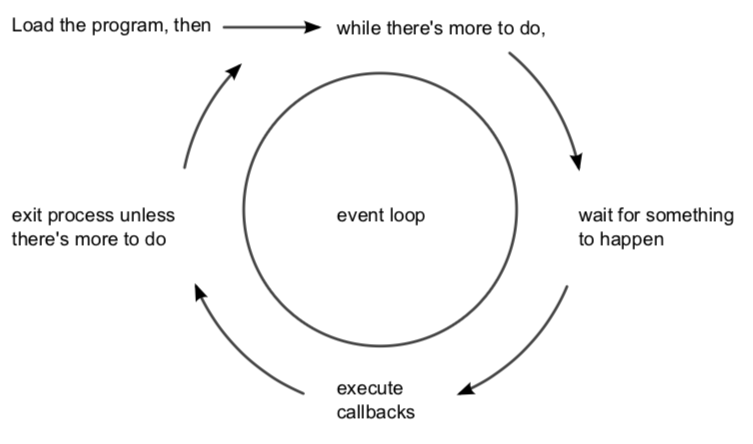
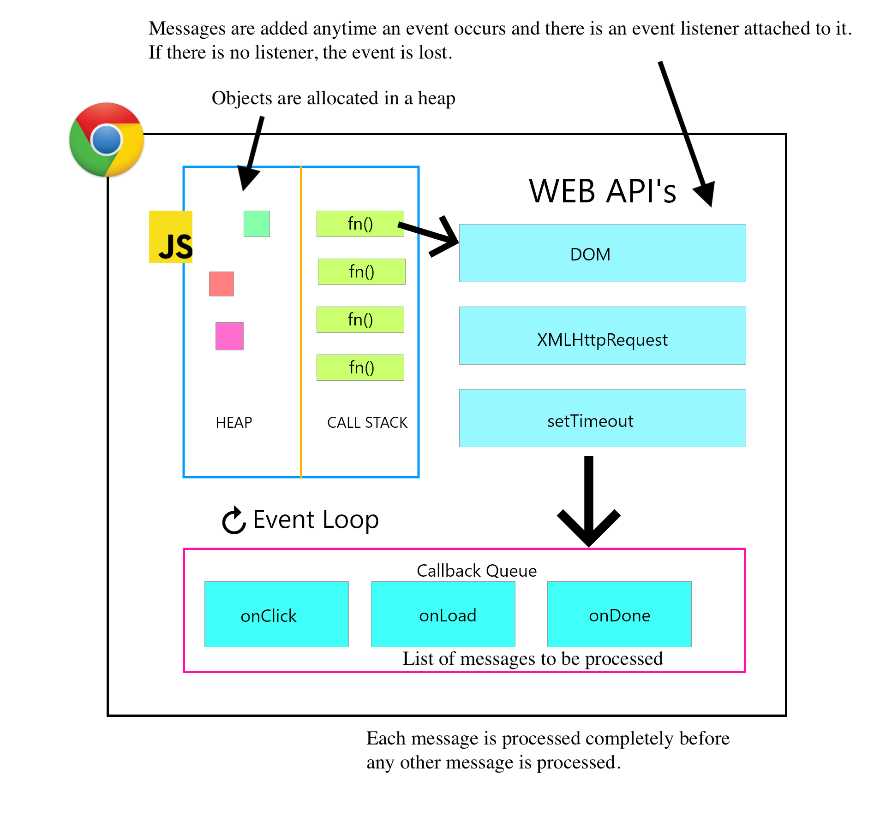

# The JS Event Loop





* Your JavaScript code runs single threaded. There is just one thing happening at a time.
    * Pay attention to how you write your code and avoid anything that could block the thread, like synchronous network calls or long loops.
    * In most browsers there is an event loop for every browser tab, to avoid a web page with heavy processing to block your entire browser.
    * Web Workers run in their own event loop as well

* [Event loop: microtasks and macrotasks](https://javascript.info/microtask-queue) en el libro https://javascript.info

## Splitting CPU Hungry Tasks

### File [p2-t1-c3-file-system/event-loop/splitting-cpu-hungry-task.html](https://github.com/ULL-MII-SYTWS-1920/ull-mii-sytws-1920.github.io/blob/master/tema1-introduccion/practicas/p2-t1-c3-file-system/event-loop/splitting-cpu-hungry-task.html)

* Ejecución: <a href="splitting-cpu-hungry-task.html" target="_blank">splitting-cpu-hungry-task.html</a>

```
[~/.../p2-t1-c3-file-system/event-loop(master)]$ pwd -P
/Users/casiano/campus-virtual/1920/sytws1920/apuntes/tema1-introduccion/practicas/p2-t1-c3-file-system/event-loop
[~/.../p2-t1-c3-file-system/event-loop(master)]$ cat splitting-cpu-hungry-task.html 
```

```js
<!DOCTYPE html>

<div id="progress"></div>

<script>
'use strict';

let start = Date.now();

let i = 0;

let chunk = () => {
  // do a piece of the heavy job (*)
  do {
    i++;
  } while (i % 1e5 != 0);
  progress.innerHTML = i;
};

let stop = () => (i == 1e7);

function count(task, condition) { 
  if (condition()) {
    alert("Done in " + (Date.now() - start) + 'ms');
  } else {
    setTimeout(() => count(task, condition)); // schedule the new call (**)
  };
  task();
}

count(chunk, stop);
</script>
```

## Web Workers

### /local/src/uai/uai2015/simple-web-worker

* [Repo de ejemplo simple-web-worker](https://github.com/SYTW/simple-web-worker)
* [Repo de ejemplo fibonacci-worker](https://github.com/ULL-MII-SYTWS-1920/fibonacci-worker)
* [MDN Tutorial: Using Web Workers](https://developer.mozilla.org/en-US/docs/Web/API/Web_Workers_API/Using_web_workers)

## Race Condition

### /local/src/uai/uai2015/race-condition/index.html

* [Repo de Ejemplo](https://github.com/ULL-MII-SYTWS-1920/js-race)
* [Race Condition in JavaScript](https://youtu.be/wNwBzgDm0BI) YouTube Video


## Promises

### local/src/uai/uai2015/promise-ejemplo

* [A Gist with a very Simple Example of How to make and use a Promise](https://gist.github.com/crguezl/f5c52c8b72b4722e374a8af10e9d2b5d)

### apuntes/tema1-introduccion/practicas/p2-t1-c3-file-system/event-loop/promise-ejemplo/promise-job-queue.js

Promises that resolve before the current function ends 
will be executed right after the current function.

```js
[~/.../p2-t1-c3-file-system/event-loop/promise-ejemplo/(master)]$ cat promise-job-queue.js 
let promise = new Promise(function(resolve, reject) {
  resolve(1)
});

promise.then(function(resolve) {console.log(1)});

console.log('a');

promise.then(function(resolve) {console.log(2);});

setTimeout(function() {console.log('h')}, 0);

promise.then(function(resolve) {console.log(3)});

console.log('b');
```

## Códigos Ilustrando el Bucle de Eventos


### tema1-introduccion/practicas/p2-t1-c3-file-system/event-loop/callstack.js 

* Tutorial [Concurrency model and Event Loop](https://developer.mozilla.org/en-US/docs/Web/JavaScript/EventLoop) at https://developer.mozilla.org

```js
function multiply(x,y) {
  // console.trace imprime una traza de la pila
  console.trace("-----------At multiply-----------");
  return x * y;
}

function squared(n) {
  console.trace("-----------At squared-----------");
  return multiply(n,n)
}

function printSquare(n) {
   return squared(n)
}

let numberSquared = printSquare(5);
console.log(numberSquared);
```

### tema1-introduccion/practicas/p2-t1-c3-file-system/event-loop/settimeout-does-not-run-inmediately.js 

* Tutorial [Concurrency model and Event Loop](https://developer.mozilla.org/en-US/docs/Web/JavaScript/EventLoop) at https://developer.mozilla.org


```js
const s = new Date().getSeconds();

setTimeout(function() {
  console.log("Ran after " + (new Date().getSeconds() - s) + " seconds");
}, 500);

while(true) {
  if(new Date().getSeconds() - s >= 2) {
    console.log("Good, looped for 2 seconds");
    break;
  }
}
```

### tema1-introduccion/practicas/p2-t1-c3-file-system/event-loop/order.js 

* Tutorial [Concurrency model and Event Loop](https://developer.mozilla.org/en-US/docs/Web/JavaScript/EventLoop) at https://developer.mozilla.org


```js
(function() {

  console.log('this is the start');

  setTimeout(function cb() {
    console.log('Callback 1: this is a msg from call back');
  }); // has a default time value of 0

  console.log('this is just a message');

  setTimeout(function cb1() {
    console.log('Callback 2: this is a msg from call back');
  }, 0);

  console.log('this is the end');

})();
```

## References

* [Event loop: microtasks and macrotasks](https://javascript.info/microtask-queue) en el libro https://javascript.info
* Tutorial [Concurrency model and Event Loop](https://developer.mozilla.org/en-US/docs/Web/JavaScript/EventLoop) at https://developer.mozilla.org
* [The JavaScript Event Loop](https://flaviocopes.com/javascript-event-loop/) by Flavio
* [Concurrency and Parallel Computing in JavaScript](https://www.infoq.com/presentations/javascript-concurrency-parallelism/) Stephan Herhut. Strange Loop 2013.
* [Philip Roberts: ¿Que diablos es el "event loop" (bucle de eventos) de todos modos? (JSConf EU)](https://www.youtube.com/watch?v=8aGhZQkoFbQ)
* [loupe](http://latentflip.com/loupe/?code=JC5vbignYnV0dG9uJywgJ2NsaWNrJywgZnVuY3Rpb24gb25DbGljaygpIHsKICAgIHNldFRpbWVvdXQoZnVuY3Rpb24gdGltZXIoKSB7CiAgICAgICAgY29uc29sZS5sb2coJ1lvdSBjbGlja2VkIHRoZSBidXR0b24hJyk7ICAgIAogICAgfSwgMjAwMCk7Cn0pOwoKY29uc29sZS5sb2coIkhpISIpOwoKc2V0VGltZW91dChmdW5jdGlvbiB0aW1lb3V0KCkgewogICAgY29uc29sZS5sb2coIkNsaWNrIHRoZSBidXR0b24hIik7Cn0sIDUwMDApOwoKY29uc29sZS5sb2coIldlbGNvbWUgdG8gbG91cGUuIik7!!!PGJ1dHRvbj5DbGljayBtZSE8L2J1dHRvbj4%3D) a tool in the cloud to see the event loop working
