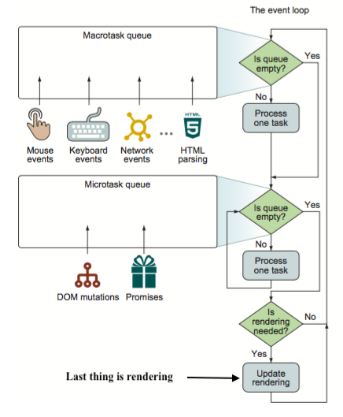

# Microtasks

## Introduction

As with callbacks, promise handlers in `.then`/`.catch`/`.finally` are always asynchronous.

Even when a Promise is immediately resolved, the code on the lines *below* the `.then`/`.catch`/`.finally` will execute before these handlers.

Asynchronous tasks need proper management:

For that, the ECMA standard specifies **an internal queue `PromiseJobs`**, more often referred to as the "**microtask queue**" (ES8 term).

As stated in the [specification](https://tc39.github.io/ecma262/#sec-jobs-and-job-queues):

- The queue is first-in-first-out: tasks enqueued first are run first.
- Execution of a task is initiated only when nothing else is running.

Or, to say more simply, 

1. when a promise is ready, its `.then/catch/finally` handlers are put into the queue; they are not executed yet. 
2. When the JavaScript engine becomes free from the current code, it takes a task from the queue and executes it.

If there's a chain with multiple `.then/catch/finally`, then every one of them is executed asynchronously. That is, 

* It first gets queued when is ready, then executed only when 
  1. the current code is complete and 
  2. previously queued handlers are finished.

For example:

```js 
Promise.resolve()
  .then(() => console.log("1"))
  .then(() => console.log("2"));
console.log(0);
```

Will produce as output: `"0\n1\n2\n"`

Microtasks are used *under the cover* of `await` as well, as it's another form of promise handling.

## Question

What is the output of this program?

```js

```

## Solution

* [Solution](solution.md)

## Explanations

There is a special function `queueMicrotask(func)` that queues `func` for execution in the microtask queue.

**The engine executes all tasks from *microtask* queue, prior to running any other macrotasks or rendering or anything else.**


The richer event loop picture may look like this figure taken from [the blog ddcode.net](https://ddcode.net/2019/06/20/analysis-of-microtask-and-macrotask-in-js-event-cycle/)



Almost quoting [this blog *The JavaScript event loop: micro-tasks and macro-tasks* by Siddharth Jain (2019)](https://www.imaginea.com/the-javascript-event-loop-micro-tasks-and-macro-tasks/):

> One macro-task is completed from the macro-task (Task) queue inside message queue. On completion of that task, the event loop goes to the micro-task (Job) queue. The *event loop* does not look into the next action until the completion of the entire micro-task (Job) queue. It finishes the entire micro-task queue and then moves back to render (if needed) and then to the macro-task queue.

> Task Queue → Micro-task → Render → Macro-task

Observe that DOM modification (dynamic changes in the DOM, for example, added or removed elements or changes in attributes values) go to the microtask queue, so that these tasks can be executed before the browser re-renders.

All microtasks are completed before any other event handling or **rendering** or any other macrotask takes place.


That's important, **as it guarantees that the application environment is basically the same (no mouse coordinate changes, no new network data, etc) between microtasks**.
