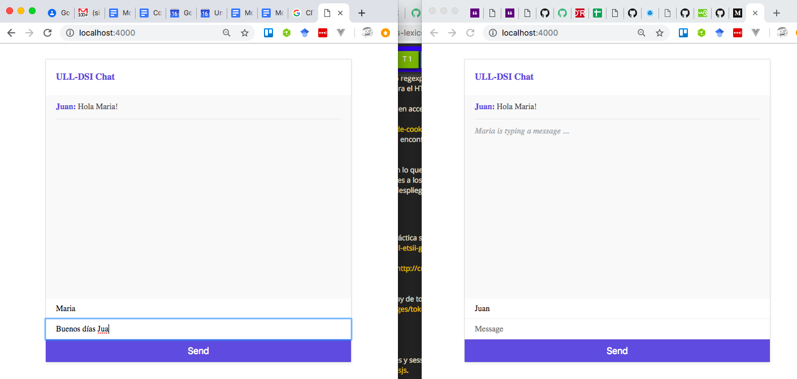

# Reto 1 para la práctica p5-t3-websockets

* Add *{user} is typing ...* functionality.



## Tip: Decida en que lugar del documento saldrá el mensaje `... is typing`

En el HTML, deberá decidir donde va a aparecer el mensaje de *feedback* indicando que un usuario
esta tecleando y añadirle un `id`.` `Por ejemplo:

```html
<div id="feedback"></div>
```

## Tip: Como escuchar por las pulsaciones de teclas

Le puede ayudar añadir en el código del cliente una llamada a el método `addEventListener`:

```js
target.addEventListener(tipo, listener);
```

* `tipo`: Una cadena representando el  tipo de evento a escuchar.
  - The [keydown](https://developer.mozilla.org/en-US/docs/Web/Events/keydown) event is fired when a key is pressed down.
  - Unlike the [keypress](https://developer.mozilla.org/en-US/docs/Web/Events/keypress) event, the `keydown`:w
 event is fired for all keys, regardless of whether they produce a character value.
* `listener`: normalmente la function que será llamada cuando ocurre el evento `tipo` sobre el elemento del DOM representado por `target`. En este caso el código de `listener` deberá emitir un mensaje indicando que el usuario esta tecleando.
* El server debería recoger el mensaje y hacer un broadcast del mismo al resto de clientes conectados

# Reto 2 para la práctica p5-t3-websockets

* Añáda rooms a su chat. Establezca dos rooms llamadas `practicas` y `ocio`

Vea los ejemplos en [ULL-ESIT-DSI-1819/socket-io-namespaces](https://github.com/ULL-ESIT-DSI-1819/socket-io-namespaces)
y lea la sección [Namespaces](https://socket.io/docs/rooms-and-namespaces/) de la documentación de Socket.io

Puede hacer este ejercicio usando namespaces o rooms.

## Usando namespaces

En el directorio `ns` tiene un ejemplo de como usar *namespaces*:

Fichero **ns/index.js**

```js
const path = require('path');
const express = require('express');
const app = express();
const http = require('http').Server(app);
const io = require('socket.io')(http);

// view engine setup
app.set('views', path.join(__dirname, 'views'));
app.set('view engine', 'ejs');

app.use(express.static('public'));

app.get('/:namespace', function(req, res) {
   res.render('space', { space: req.params.namespace});
});

function welcome(nsp, socket, spaceName) {
   console.log('someone connected to '+spaceName);
   socket.emit('hi', `Welcome client '${socket.id}' to ${spaceName}!`);
   nsp.emit('hi', `Client '${socket.id}' joined ${spaceName}!`);
}

const nsp = io.of('/my-namespace');
nsp.on('connection', function(socket) {
   welcome(nsp, socket, '/my-namespace');
});

const nsp2 = io.of('/your-namespace');
nsp2.on('connection', function(socket) {
   welcome(nsp2, socket, '/your-namespace');
});

http.listen(3000, function() {
   console.log('listening on localhost:3000');
});
```

Fichero **ns/public/index.html**

```html
<!DOCTYPE HTML>
<html lang="en">
<head>
  <meta charset="UTF-8">
  <title></title>
</head>
<body>
  <ul>
    <li><a href="/my-namespace">my-namespace</a></li>
    <li><a href="/your-namespace">your-namespace</a></li>
  </ul>
</body>
</html>
```

Fichero **ns/views/space.ejs**:

```html
<!DOCTYPE html>
<html>
   <head>
      <title>Hello world</title>
   </head>
   <script src="/socket.io/socket.io.js"></script>

   <script>
      const socket = io('/<%- space %>');
      let chat = document.getElementById("chat");
      socket.on('hi',function(data) {
        chat.innerHTML += `<p>${data}</p>`;
      });
   </script>
   <body>
     <div id="chat"></div>
   </body>
</html>
```

## Usando rooms

Fichero **rooms/index.js**:

```js
var path = require('path');
var express = require('express');
var app = express();
var http = require('http').Server(app);
var io = require('socket.io')(http);

// view engine setup
app.set('views', path.join(__dirname, 'views'));
app.set('view engine', 'ejs');

app.use(express.static('public'));

app.get('/:room', function(req, res) {
   res.render('room', { room: req.params.room});
});

var nsp = io.of('/my-namespace');
nsp.on('connection', function(socket) {
   socket.emit('hi', `Welcome client '${socket.id}' to my-namespace!`);
    socket.on('join', function(room) {
        console.log("room = "+room);
        socket.join(room);
        nsp.to(room).emit('hi', socket.id+' joined room "'+room+'"');
    });
   console.log('someone connected: '+socket.id);
});

http.listen(3000, function() {
   console.log('listening on localhost:3000');
});
```

Fichero **rooms/public/index.html**:

```html
<!DOCTYPE HTML>
<html lang="en">
<head>
  <meta charset="UTF-8">
  <title></title>
</head>
<body>
  <ul>
    <li><a href="/room-1">room-1</a></li>
    <li><a href="/room-2">room-2</a></li>
  </ul>
</body>
</html>
```

Fichero **rooms/views/room.ejs**:

```html
<!DOCTYPE html>
<html>
   <head>
      <title>Hello world</title>
   </head>
   <script src = "/socket.io/socket.io.js"></script>

   <script>
      const socket = io('/my-namespace');

      socket.emit('join', '<%- room %>');

      let chat = document.getElementById("chat");
      socket.on('hi',function(data) {
        chat.innerHTML += `<p>${data}</p>`;
      });
   </script>
   <body>
     <div id="chat"></div>
   </body>
</html>
```
