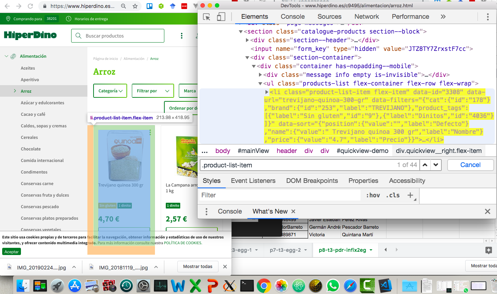
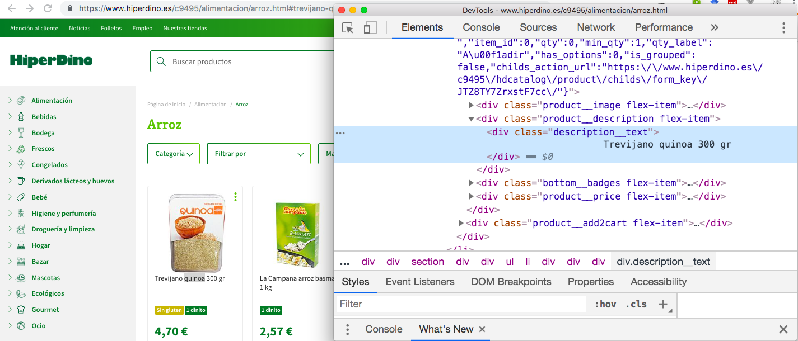
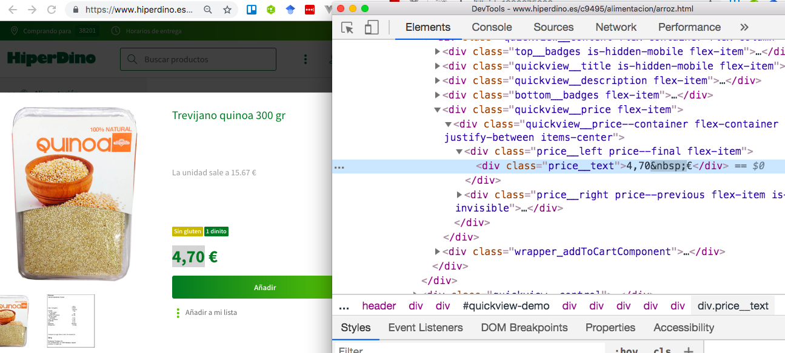

# Reto p9-t3-transfoming-data

Usando los módulos

* [request](https://www.npmjs.com/package/request)  o [request-promise](https://www.npmjs.com/package/request-promise) y 
* [cheerio](https://www.npmjs.com/package/cheerio), 

Escriba un programa Node.js  al que se le pasa como argumento en línea de comandos una categoría de alimento 
y que muestre una lista de objetos JSON con las descripciones de 
los productos y precios de los productos en Hiperdino que caen en dicha categoría.

Algo similar a esto:

```
$ ./hiperdino.js cacao-y-cafe
{ "precio": "1,04 €", "descripcion": "Candelaria baxcao cacao 250 gr"}
{ "precio": "2,72 €", "descripcion": "Cola Cao avenacao cacao soluble 350 gr"}
{ "precio": "2,42 €", "descripcion": "Cola Cao cacao 0% fibra 300 gr"}
{ "precio": "13,94 €", "descripcion": "Cola Cao cacao 3 kg"}
{ "precio": "22,52 €", "descripcion": "Cola Cao cacao caja 5 kg"}
{ "precio": "2,62 €", "descripcion": "Cola Cao cacao complet 360 gr"}
{ "precio": "5,46 €", "descripcion": "Cola Cao cacao ecobolsa 1,2 kg"}
{ "precio": "6,59 €", "descripcion": "Cola Cao cacao en polvo instantáneo 0% 700 gr"}
{ "precio": "2,96 €", "descripcion": "Cola Cao cacao light 325 gr"}
{ "precio": "3,29 €", "descripcion": "Cola Cao cacao noir300 gr"}
{ "precio": "2,70 €", "descripcion": "Cola Cao cacao original 400 gr"}
{ "precio": "4,41 €", "descripcion": "Cola Cao cacao original 800 gr"}
...

```

La idea es que en la web  de Hiperdino para obtener la información sobre una categoría de productos como `arroz` debemos hacer un request a una ruta como esta:

[https://online.hiperdino.es/c9495/alimentacion/arroz.html](https://online.hiperdino.es/c9495/alimentacion/arroz.html)

En general para una `:categoria-de-alimento` 
la ruta será `https://online.hiperdino.es/c9495/alimentacion/:categoria-de-alimento.html`

## Categorías de Alimentos de Hiperdino

Estas son algunas categorías de alimentos reconocidas por Hiperdino:

* [arroz](https://online.hiperdino.es/c9495/alimentacion/arroz) 
* [aceites](https://online.hiperdino.es/c9495/alimentacion/aceites) 
* [azucar-y-edulcorantes](https://online.hiperdino.es/c9495/alimentacion/azucar-y-edulcorantes) 
* [cacao-y-cafe](https://online.hiperdino.es/c9495/alimentacion/cacao-y-cafe) 
* [conservas-fruta-y-dulces](https://online.hiperdino.es/c9495/alimentacion/conservas-fruta-y-dulces)

En general, se puede saber que categorías de alimentos están disponibles visitando la página
[https://www.hiperdino.es/](https://www.hiperdino.es/). En la izquierda aparece un menu navgable con los categorías de alimentos. Cuando visite esta página,
pulse en el menú de contexto `inspeccionar` estando en el panel izquierdo 
sobre la categoría de alimento deseada y así podrá saber el nombre la página HTML:


De hecho si nos descargamos 
[la página html de https://www.hiperdino.es/](hiperdino.md) 
y hacemos una búsqueda con `grep` 
como esta:

```
$ grep 'https://www.hiperdino.es/c9495/alimentacion/' hiperdino.md 
```

obtenemos la lista de páginas HTML para las categorías de alimentos:

```
"https://www.hiperdino.es/c9495/alimentacion/aceites.html" rel=
"noreferrer noopener">https://www.hiperdino.es/c9495/alimentacion/aceites.html</a>"
"https://www.hiperdino.es/c9495/alimentacion/aperitivo.html" rel=
"noreferrer noopener">https://www.hiperdino.es/c9495/alimentacion/aperitivo.html</a>"
"https://www.hiperdino.es/c9495/alimentacion/arroz.html" rel=
"noreferrer noopener">https://www.hiperdino.es/c9495/alimentacion/arroz.html</a>"
"https://www.hiperdino.es/c9495/alimentacion/azucar-y-edulcorantes.html"
"noreferrer noopener">https://www.hiperdino.es/c9495/alimentacion/azucar-y-edulcorantes.html</a>"
"https://www.hiperdino.es/c9495/alimentacion/cacao-y-cafe.html"
rel="noreferrer noopener">https://www.hiperdino.es/c9495/alimentacion/cacao-y-cafe.html</a>"
"https://www.hiperdino.es/c9495/alimentacion/caldos-sopas-y-cremas.html"
"noreferrer noopener">https://www.hiperdino.es/c9495/alimentacion/caldos-sopas-y-cremas.html</a>"
"https://www.hiperdino.es/c9495/alimentacion/cereales.html" rel=
"noreferrer noopener">https://www.hiperdino.es/c9495/alimentacion/cereales.html</a>"
"https://www.hiperdino.es/c9495/alimentacion/chocolate.html" rel=
"noreferrer noopener">https://www.hiperdino.es/c9495/alimentacion/chocolate.html</a>"
"https://www.hiperdino.es/c9495/alimentacion/comida-internacional.html"
"noreferrer noopener">https://www.hiperdino.es/c9495/alimentacion/comida-internacional.html</a>"
"https://www.hiperdino.es/c9495/alimentacion/condimentos.html" rel=
"noreferrer noopener">https://www.hiperdino.es/c9495/alimentacion/condimentos.html</a>"
"https://www.hiperdino.es/c9495/alimentacion/conservas-carne.html"
...
```

## Sugerencias para Buscar la Descripción y Precio de un Item de una Categoría de Producto

A fecha de Mayo de 2019 la página de Hiperdino para una categoría de producto
`https://online.hiperdino.es/c9495/alimentacion/categoria-de-alimento.html`
tiene una estructura como sigue:

* Cada producto se describe en un elemento `div` con la clase `.product-list-item`

  

* La descripción del producto está en un `div` con la clase `.description__text`

  

* El precio aparece en un elemento `div`con la clase `.price__left` y dentro del mismo en un `div` con la clase
`.price__text`

  

## Recursos. Páginas Completas

* [Página Completa de la categoría *arroz*: https://www.hiperdino.es/c9495/alimentacion/arroz.html](arroz.md) (Mayo 2019)
* [Página Completa https://www.hiperdino.es/c9495/](hiperdino.md) (Mayo 2019)
