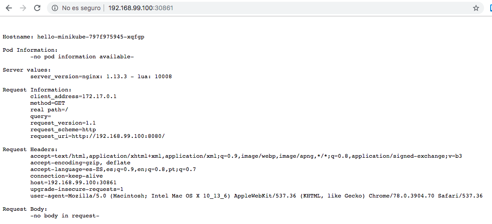

# Kubernetes

## Instalar VirtualBox

VirtualBox is a generic tool for running virtual machines. You can use it to run Ubuntu, Windows, OS X, etc. inside your  operating system host.

```
$ brew cask install virtualbox
```

## Instalar minikube

Minikube is a tool that makes it easy to run Kubernetes locally. Minikube runs a single-node Kubernetes cluster inside a Virtual Machine (VM) on your laptop for users looking to try out Kubernetes or develop with it day-to-day.


```
$ brew install minikube
Updating Homebrew...
==> Downloading https://homebrew.bintray.com/bottles/minikube-1.5.2.high_sierra.bottle.tar.gz
==> Downloading from https://akamai.bintray.com/5c/5c5d913c4cd18463ab10384d35fc59624e678874d8219cbc5af3b88a17eb89d8?__gda__=exp=15
######################################################################## 100.0%
==> Pouring minikube-1.5.2.high_sierra.bottle.tar.gz
==> Caveats
Bash completion has been installed to:
  /usr/local/etc/bash_completion.d

zsh completions have been installed to:
  /usr/local/share/zsh/site-functions
==> Summary
🍺  /usr/local/Cellar/minikube/1.5.2: 8 files, 51.5MB
$ minikube start
😄  minikube v1.5.2 on Darwin 10.13.6
✨  Automatically selected the '' driver
💣  Unable to determine a default driver to use. Try specifying --vm-driver, or see https://minikube.sigs.k8s.io/docs/start/
```

## minikube help

```
$ minikube help
Minikube is a CLI tool that provisions and manages single-node Kubernetes clusters optimized for development workflows.

Basic Commands:
  start          Starts a local kubernetes cluster
  status         Gets the status of a local kubernetes cluster
  stop           Stops a running local kubernetes cluster
  delete         Deletes a local kubernetes cluster
  dashboard      Access the kubernetes dashboard running within the minikube cluster

Images Commands:
  docker-env     Sets up docker env variables; similar to '$(docker-machine env)'
  cache          Add or delete an image from the local cache.

Configuration and Management Commands:
  addons         Modify minikube's kubernetes addons
  config         Modify minikube config
  profile        Profile gets or sets the current minikube profile
  update-context Verify the IP address of the running cluster in kubeconfig.

Networking and Connectivity Commands:
  service        Gets the kubernetes URL(s) for the specified service in your local cluster
  tunnel         tunnel makes services of type LoadBalancer accessible on localhost

Advanced Commands:
  mount          Mounts the specified directory into minikube
  ssh            Log into or run a command on a machine with SSH; similar to 'docker-machine ssh'
  kubectl        Run kubectl

Troubleshooting Commands:
  ssh-key        Retrieve the ssh identity key path of the specified cluster
  ip             Retrieves the IP address of the running cluster
  logs           Gets the logs of the running instance, used for debugging minikube, not user code.
  update-check   Print current and latest version number
  version        Print the version of minikube

Other Commands:
  completion     Outputs minikube shell completion for the given shell (bash or zsh)

Use "minikube <command> --help" for more information about a given command.
```

## Configurar `vm-driver` para minikube

```
$ minikube help config
config modifies minikube config files using subcommands like "minikube config set vm-driver kvm"
Configurable fields: 

 * vm-driver
 * container-runtime
 * feature-gates
 * v
 * cpus
 * disk-size
 * host-only-cidr
 * memory
 * log_dir
 * kubernetes-version
 * iso-url
 * WantUpdateNotification
 * ReminderWaitPeriodInHours
 * WantReportError
 * WantReportErrorPrompt
 * WantKubectlDownloadMsg
 * WantNoneDriverWarning
 * profile
 * bootstrapper
 * ShowDriverDeprecationNotification
 * ShowBootstrapperDeprecationNotification
 * dashboard
 * addon-manager
 * default-storageclass
 * heapster
 * efk
 * ingress
 * insecure-registry
 * registry
 * registry-creds
 * freshpod
 * storage-provisioner
 * storage-provisioner-gluster
 * metrics-server
 * nvidia-driver-installer
 * nvidia-gpu-device-plugin
 * logviewer
 * gvisor
 * helm-tiller
 * ingress-dns
 * hyperv-virtual-switch
 * disable-driver-mounts
 * cache
 * embed-certs
 * native-ssh

Available Commands:
  get         Gets the value of PROPERTY_NAME from the minikube config file
  set         Sets an individual value in a minikube config file
  unset       unsets an individual value in a minikube config file
  view        Display values currently set in the minikube config file

Usage:
  minikube config SUBCOMMAND [flags] [options]

Use "minikube <command> --help" for more information about a given command.
Use "minikube config options" for a list of global command-line options (applies to all commands).
```

```
$ minikube config set vm-driver virtualbox
⚠️  These changes will take effect upon a minikube delete and then a minikube start
```

## Start Minikube and create a cluster

```
$ minikube start
😄  minikube v1.5.2 on Darwin 10.13.6
🔥  Creating virtualbox VM (CPUs=2, Memory=2000MB, Disk=20000MB) ...
🐳  Preparing Kubernetes v1.16.2 on Docker '18.09.9' ...
💾  Downloading kubeadm v1.16.2
💾  Downloading kubelet v1.16.2
🚜  Pulling images ...
🚀  Launching Kubernetes ... 
⌛  Waiting for: apiserver
🏄  Done! kubectl is now configured to use "minikube"
```

## kubectl 

`kubectl` is the command line application that lets you interact with your Minikube Kubernetes cluster. It sends request to the **Kubernetes API server running on the cluster** to manage your Kubernetes environment. 

`kubectl` is like any other application that runs on your machine: it just makes HTTP requests to the **Kubernetes API** on the cluster.

## Kubectl version

```
$ kubectl version
Client Version: version.Info{Major:"1", Minor:"16", GitVersion:"v1.16.2", GitCommit:"c97fe5036ef3df2967d086711e6c0c405941e14b", GitTreeState:"clean", BuildDate:"2019-10-15T23:43:08Z", GoVersion:"go1.12.10", Compiler:"gc", Platform:"darwin/amd64"}
```

### Kubectl help

```
$ kubectl

Basic Commands (Beginner):
  create         Create a resource from a file or from stdin.
  expose         Take a replication controller, service, deployment or pod and expose it as a new Kubernetes Service
  run            Run a particular image on the cluster
  set            Set specific features on objects

Basic Commands (Intermediate):
  explain        Documentation of resources
  get            Display one or many resources
  edit           Edit a resource on the server
  delete         Delete resources by filenames, stdin, resources and names, or by resources and label selector

Deploy Commands:
  rollout        Manage the rollout of a resource
  scale          Set a new size for a Deployment, ReplicaSet, Replication Controller, or Job
  autoscale      Auto-scale a Deployment, ReplicaSet, or ReplicationController

Cluster Management Commands:
  certificate    Modify certificate resources.
  cluster-info   Display cluster info
  top            Display Resource (CPU/Memory/Storage) usage.
  cordon         Mark node as unschedulable
  uncordon       Mark node as schedulable
  drain          Drain node in preparation for maintenance
  taint          Update the taints on one or more nodes

Troubleshooting and Debugging Commands:
  describe       Show details of a specific resource or group of resources
  logs           Print the logs for a container in a pod
  attach         Attach to a running container
  exec           Execute a command in a container
  port-forward   Forward one or more local ports to a pod
  proxy          Run a proxy to the Kubernetes API server
  cp             Copy files and directories to and from containers.
  auth           Inspect authorization

Advanced Commands:
  diff           Diff live version against would-be applied version
  apply          Apply a configuration to a resource by filename or stdin
  patch          Update field(s) of a resource using strategic merge patch
  replace        Replace a resource by filename or stdin
  wait           Experimental: Wait for a specific condition on one or many resources.
  convert        Convert config files between different API versions
  kustomize      Build a kustomization target from a directory or a remote url.

Settings Commands:
  label          Update the labels on a resource
  annotate       Update the annotations on a resource
  completion     Output shell completion code for the specified shell (bash or zsh)

Other Commands:
  api-resources  Print the supported API resources on the server
  api-versions   Print the supported API versions on the server, in the form of "group/version"
  config         Modify kubeconfig files
  plugin         Provides utilities for interacting with plugins.
  version        Print the client and server version information

Usage:
  kubectl [flags] [options]

Use "kubectl <command> --help" for more information about a given command.
Use "kubectl options" for a list of global command-line options (applies to all commands).
```

## kubectl api-versions

```
$ kubectl help api-versions
Print the supported API versions on the server, in the form of "group/version"

Examples:
  # Print the supported API versions
  kubectl api-versions

Usage:
  kubectl api-versions [flags] [options]

Use "kubectl options" for a list of global command-line options (applies to all commands).
```

```
$ kubectl api-versions
admissionregistration.k8s.io/v1
admissionregistration.k8s.io/v1beta1
apiextensions.k8s.io/v1
apiextensions.k8s.io/v1beta1
apiregistration.k8s.io/v1
apiregistration.k8s.io/v1beta1
apps/v1
authentication.k8s.io/v1
authentication.k8s.io/v1beta1
authorization.k8s.io/v1
authorization.k8s.io/v1beta1
autoscaling/v1
autoscaling/v2beta1
autoscaling/v2beta2
batch/v1
batch/v1beta1
certificates.k8s.io/v1beta1
coordination.k8s.io/v1
coordination.k8s.io/v1beta1
events.k8s.io/v1beta1
extensions/v1beta1
networking.k8s.io/v1
networking.k8s.io/v1beta1
node.k8s.io/v1beta1
policy/v1beta1
rbac.authorization.k8s.io/v1
rbac.authorization.k8s.io/v1beta1
scheduling.k8s.io/v1
scheduling.k8s.io/v1beta1
storage.k8s.io/v1
storage.k8s.io/v1beta1
v1
```

## Stop the cluster: minikube stop

```
[~/.../chapter20-nodejs/juanIrache-20_3_public_space(master)]$ minikube stop
✋  Stopping "minikube" in virtualbox ...
🛑  "minikube" stopped.
```

## Seen the status: minikube status

```
$ minikube status
host: Running
kubelet: Running
apiserver: Running
kubeconfig: Configured
```

## kubectl create

```
$ kubectl help create
Create a resource from a file or from stdin.

 JSON and YAML formats are accepted.

Examples:
  # Create a pod using the data in pod.json.
  kubectl create -f ./pod.json
  
  # Create a pod based on the JSON passed into stdin.
  cat pod.json | kubectl create -f -
  
  # Edit the data in docker-registry.yaml in JSON then create the resource using the edited data.
  kubectl create -f docker-registry.yaml --edit -o json

Available Commands:
  clusterrole         Create a ClusterRole.
  clusterrolebinding  Create a ClusterRoleBinding for a particular ClusterRole
  configmap           Create a configmap from a local file, directory or literal value
  cronjob             Create a cronjob with the specified name.
  deployment          Create a deployment with the specified name.
  job                 Create a job with the specified name.
  namespace           Create a namespace with the specified name
  poddisruptionbudget Create a pod disruption budget with the specified name.
  priorityclass       Create a priorityclass with the specified name.
  quota               Create a quota with the specified name.
  role                Create a role with single rule.
  rolebinding         Create a RoleBinding for a particular Role or ClusterRole
  secret              Create a secret using specified subcommand
  service             Create a service using specified subcommand.
  serviceaccount      Create a service account with the specified name

Options:
      --allow-missing-template-keys=true: If true, ignore any errors in templates when a field or map key is missing in
the template. Only applies to golang and jsonpath output formats.
      --dry-run=false: If true, only print the object that would be sent, without sending it.
      --edit=false: Edit the API resource before creating
  -f, --filename=[]: Filename, directory, or URL to files to use to create the resource
  -k, --kustomize='': Process the kustomization directory. This flag can't be used together with -f or -R.
  -o, --output='': Output format. One of:
json|yaml|name|go-template|go-template-file|template|templatefile|jsonpath|jsonpath-file.
      --raw='': Raw URI to POST to the server.  Uses the transport specified by the kubeconfig file.
      --record=false: Record current kubectl command in the resource annotation. If set to false, do not record the
command. If set to true, record the command. If not set, default to updating the existing annotation value only if one
already exists.
  -R, --recursive=false: Process the directory used in -f, --filename recursively. Useful when you want to manage
related manifests organized within the same directory.
      --save-config=false: If true, the configuration of current object will be saved in its annotation. Otherwise, the
annotation will be unchanged. This flag is useful when you want to perform kubectl apply on this object in the future.
  -l, --selector='': Selector (label query) to filter on, supports '=', '==', and '!='.(e.g. -l key1=value1,key2=value2)
      --template='': Template string or path to template file to use when -o=go-template, -o=go-template-file. The
template format is golang templates [http://golang.org/pkg/text/template/#pkg-overview].
      --validate=true: If true, use a schema to validate the input before sending it
      --windows-line-endings=false: Only relevant if --edit=true. Defaults to the line ending native to your platform.

Usage:
  kubectl create -f FILENAME [options]

Use "kubectl <command> --help" for more information about a given command.
Use "kubectl options" for a list of global command-line options (applies to all commands).
```

## kubectl help create deployment

```
$ kubectl help create deployment
Create a deployment with the specified name.

Aliases:
deployment, deploy

Examples:
  # Create a new deployment named my-dep that runs the busybox image.
  kubectl create deployment my-dep --image=busybox

Options:
      --allow-missing-template-keys=true: If true, ignore any errors in templates when a field or map key is missing in
the template. Only applies to golang and jsonpath output formats.
      --dry-run=false: If true, only print the object that would be sent, without sending it.
      --generator='': The name of the API generator to use.
      --image=[]: Image name to run.
  -o, --output='': Output format. One of:
json|yaml|name|go-template|go-template-file|template|templatefile|jsonpath|jsonpath-file.
      --save-config=false: If true, the configuration of current object will be saved in its annotation. Otherwise, the
annotation will be unchanged. This flag is useful when you want to perform kubectl apply on this object in the future.
      --template='': Template string or path to template file to use when -o=go-template, -o=go-template-file. The
template format is golang templates [http://golang.org/pkg/text/template/#pkg-overview].
      --validate=true: If true, use a schema to validate the input before sending it

Usage:
  kubectl create deployment NAME --image=image [--dry-run] [options]

Use "kubectl options" for a list of global command-line options (applies to all commands).
```

## kubectl create deployment hello-minikube --image=k8s.gcr.io/echoserver:1.10

Now, you can interact with your cluster using `kubectl`. 

For more information, see [Interacting with Your Cluster](https://kubernetes.io/docs/setup/learning-environment/minikube/#interacting-with-your-cluster).

Let’s create a Kubernetes Deployment using an existing image named `echoserver`, 
which is a simple HTTP server and expose it on port 8080 using `--port`.

```
$ kubectl create deployment hello-minikube --image=k8s.gcr.io/echoserver:1.10
deployment.apps/hello-minikube created
```

To access the hello-minikube Deployment, expose it as a Service:

```
[~/.../chapter20-nodejs/juanIrache-20_3_public_space(master)]$ kubectl expose deployment hello-minikube --type=NodePort --port=8080
service/hello-minikube exposed
```

The option `--type=NodePort` specifies the type of the Service.

The `hello-minikube` Pod is now launched but you have to wait until the Pod is up before accessing it via the exposed Service.

Check if the Pod is up and running:

```
[~/.../chapter20-nodejs/juanIrache-20_3_public_space(master)]$ kubectl get pod
NAME                              READY   STATUS    RESTARTS   AGE
hello-minikube-797f975945-xqfgp   1/1     Running   0          2m22s
```
If the output shows the `STATUS` as `ContainerCreating`, the Pod is still being created.
If the output shows the `STATUS` as `Running`, the Pod is now up and running.


Get the URL of the exposed Service to view the Service details:

```
[~/.../chapter20-nodejs/juanIrache-20_3_public_space(master)]$ minikube service hello-minikube --url
http://192.168.99.100:30861
```

To view the details of your local cluster, copy and paste the URL you got as the output, on your browser.

The output is similar to this:



If you no longer want the Service and cluster to run, you can delete them.

```
$ kubectl delete services hello-minikube
service "hello-minikube" deleted
```

Stop the local Minikube cluster:

```
$ minikube stop
✋  Stopping "minikube" in virtualbox ...
🛑  "minikube" stopped.
```

## Referencias

* [How to Install Kubernetes on Mac](https://matthewpalmer.net/kubernetes-app-developer/articles/guide-install-kubernetes-mac.html) from the Kubernetes for Application Developers Book
* [Installing Kubernetes with Minikube](https://kubernetes.io/docs/setup/learning-environment/minikube/#starting-a-cluster)
* [Instalar y Configurar kubectl](https://kubernetes.io/es/docs/tasks/tools/install-kubectl/#antes-de-empezar)
* [Interacting with your cluster](https://kubernetes.io/docs/setup/learning-environment/minikube/#interacting-with-your-cluster)
